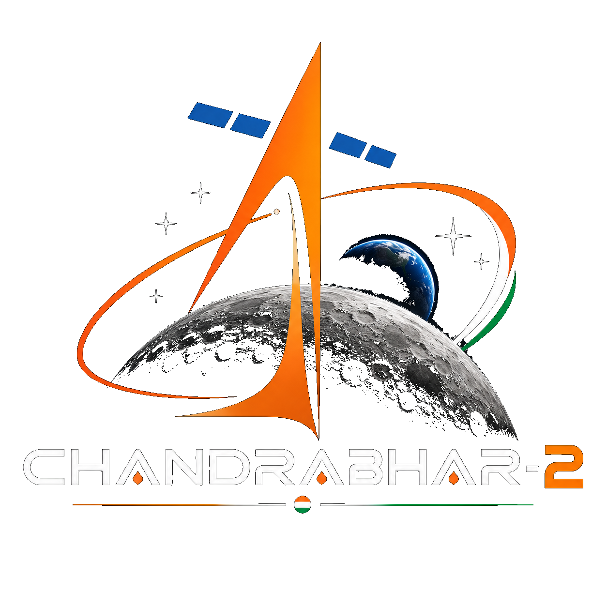

<p align="center">
  
</p>

<h1 align="center">CHANDRABHAR-2</h1>
<p align="center"><b>Multi-modal, illumination-aware and scale-aware image correspondence for Chandrayaan-2 OHRC, TMC-2 and IIRS imagery</b></p>

<p align="center">
  Independent research prototype &middot; Engine v8.0.2 &middot; Platform v2.0.0 &middot; Not an official ISRO product
</p>

---

## 1. One-line description

CHANDRABHAR-2 is a CPU-first research prototype that attempts to establish geometric
correspondence between Chandrayaan-2's three very different imaging payloads — OHRC
(panchromatic, ~0.3 m), TMC-2 (panchromatic, ~5 m) and IIRS (hyperspectral, ~80 m) — and
honestly reports whether the evidence for that correspondence is strong enough to trust.

## 2. Problem statement

Chandrayaan-2's three imagers look at the same lunar surface at wildly different spatial
resolutions, in different modalities (panchromatic vs. hyperspectral), from different orbits,
at different sun angles, and on different dates. Registering them against each other — so that
a pixel in one product can be related to a pixel in another — is not a trivial image-matching
problem: naive feature matching fails across this much scale and modality difference, and a
weak or accidental match is easy to mistake for a real one. CHANDRABHAR-2 exists to attempt this
registration carefully and to be explicit about when it has, and has not, succeeded.

## 3. Motivation

Cross-sensor correspondence is a prerequisite for compositing, change detection, and joint
photometric/spectral analysis across Chandrayaan-2 products. Rather than presenting a single
end-to-end "black box" match, CHANDRABHAR-2 exposes every stage of the pipeline — geometry,
scale normalization, representation, matching, verification, evidence gating — so the result can
be inspected and trusted, or clearly rejected, rather than assumed.

## 4. What the system does

For a chosen sensor pair, CHANDRABHAR-2:

1. Reads each product's native format and metadata through a format adapter (PDS4 label, ENVI
   header, or raw+sidecar).
2. Reads each product's ISRO GRD Scan/Pixel↔Latitude/Longitude geometry table and computes a
   true sampled-swath polygon intersection (not a bounding-box approximation).
3. Builds a common lunar geographic grid at a physically meaningful ground-sample-distance (GSD)
   and warps both products onto it, so "one grid cell" means the same thing on the ground for
   both sensors.
4. Builds a modality-robust representation of each product (and a spectral-median/IQR
   representation for hyperspectral IIRS).
5. Searches for correspondences with a cascade of matchers (structural SIFT → phase correlation
   → ECC affine refinement) and verifies candidates geometrically with RANSAC.
6. Passes the result through an **evidence gate** — a fixed, documented set of thresholds on
   inlier count, inlier ratio, spatial coverage, and residual error — before it will ever report
   `VALIDATED`. See [`docs/10_VALIDATION_AND_EVIDENCE.md`](docs/10_VALIDATION_AND_EVIDENCE.md).

A run that does not clear the gate is reported as `INSUFFICIENT_EVIDENCE`, not silently upgraded.

## 5. Supported sensors

| Sensor | Modality | Native GSD | Product type |
|---|---|---|---|
| OHRC | Panchromatic | ~0.3 m | Very-high-resolution imaging camera |
| TMC-2 | Panchromatic | ~5 m | Terrain mapping camera (also has derived GeoTIFF products) |
| IIRS | Hyperspectral | ~80 m | Imaging infrared spectrometer |

## 6. Architecture

```
Mission Data → Data Discovery (adapters) → Metadata / Geometry (ISRO GRD mapper)
  → Geographic Overlap (sampled swath intersection) → Common Lunar Grid (physical GSD)
  → Physical GSD Normalization → Illumination-Aware Representation → Correspondence
  → Geometric Verification (RANSAC) → Evidence Gate → Results / Export
```

Full component breakdown: [`docs/03_SYSTEM_ARCHITECTURE.md`](docs/03_SYSTEM_ARCHITECTURE.md).
Diagrams: [`docs/assets/diagrams/`](docs/assets/diagrams/).

## 7. Pipeline

See [`docs/06_CORRESPONDENCE_PIPELINE.md`](docs/06_CORRESPONDENCE_PIPELINE.md) for the full
stage-by-stage description, and [`app/core/pipeline.py`](app/core/pipeline.py) for the
implementation.

## 8. Installation

Requires **Python 3.10+**.

```powershell
py -3.10 -m venv .venv
.\.venv\Scripts\Activate.ps1
python -m pip install -r requirements.txt
```

`requirements.txt` already includes NumPy, OpenCV, Shapely (exact polygon intersection) and SciPy
(geometry interpolation). Optional extras for additional geospatial format support
(shapefiles, rasterio, pyproj) are in `requirements-optional.txt`:

```powershell
python -m pip install -r requirements-optional.txt
```

Full walkthrough: [`docs/13_INSTALLATION_WINDOWS.md`](docs/13_INSTALLATION_WINDOWS.md).

## 9. Windows quick-start

```powershell
RUN_CHANDRABHAR-2.bat
```

or, from PowerShell:

```powershell
.\run_chandrabhar2.ps1
```

Both install dependencies and launch the dashboard at `http://localhost:8501`.

## 10. Running the application

```powershell
python -m streamlit run dashboard.py
```

The dashboard never uploads your Chandrayaan-2 files anywhere; it reads them from a local
folder you point it at. See [`docs/14_USER_GUIDE.md`](docs/14_USER_GUIDE.md).

## 11. Running tests

```powershell
python -m pytest -q
```

Engine self-test (synthetic warp, not real mission data):

```powershell
python run.py
```

Current status recorded in this release: **18/18 tests passing**. See
[`docs/TEST_AND_VALIDATION_REPORT.md`](docs/TEST_AND_VALIDATION_REPORT.md).

## 12. Experiment workflow

1. Point the dashboard (or `python -m app.cli.main mission --root <path>`) at your local
   Chandrayaan-2 mission-data folder.
2. Inspect the discovered products in **Mission Overview**.
3. Run one or all three sensor pairs in **Correspondence Lab** — the platform's only execution
   surface.
4. Read the result in **Evidence & Metrics**.
5. Export the experiment package from **Products & Export**.

Full protocol: [`docs/11_EXPERIMENT_PROTOCOL.md`](docs/11_EXPERIMENT_PROTOCOL.md).

## 13. Output structure

```
CHANDRABHAR-2_Platform_Outputs/
├── OHRC_TMC2.json
├── OHRC_IIRS.json
├── TMC2_IIRS.json
├── summary.json
├── pair_summary.csv
└── workflow_state.json
```

## 14. Example screenshots

See [`docs/assets/screenshots/`](docs/assets/screenshots/). The included example is generated
from the software's own **synthetic self-test** (a controlled, known-warp regression scene) and
is explicitly labeled as such — it illustrates the evidence-visualization output format, not a
real-data scientific result. Screenshots of the four dashboard tabs on real mission data were not
captured in this environment (no local browser/display) and are left as placeholders for whoever
runs the platform locally.

## 15. Scientific validation status

**Not validated on real Chandrayaan-2 data as of this delivery.** The pipeline is implemented,
unit- and self-tested, and the evidence gate is enforced end-to-end. Whether any given real
OHRC↔TMC-2, OHRC↔IIRS, or TMC-2↔IIRS pair actually clears the gate depends on the specific
products used and must be run and read from the dashboard/CLI output — it is not asserted here.
See [`docs/10_VALIDATION_AND_EVIDENCE.md`](docs/10_VALIDATION_AND_EVIDENCE.md) and
[`docs/CLAIMS_MATRIX.md`](docs/CLAIMS_MATRIX.md).

## 16. Known limitations

See [`docs/18_LIMITATIONS_AND_FUTURE_WORK.md`](docs/18_LIMITATIONS_AND_FUTURE_WORK.md).

## 17. Reproducibility

See [`docs/17_REPRODUCIBILITY.md`](docs/17_REPRODUCIBILITY.md).

## 18. Data attribution

Chandrayaan-2 mission data is not included in this repository and is not owned or licensed by
this project. It remains subject to ISRO/PRADAN terms. See
[`LEGAL/ISRO_DATA_ATTRIBUTION.md`](LEGAL/ISRO_DATA_ATTRIBUTION.md) and
[`LEGAL/DATA_LICENSE_AND_USAGE.md`](LEGAL/DATA_LICENSE_AND_USAGE.md).

## 19. License

**Proprietary / All Rights Reserved. No license is granted to use, copy, modify, redistribute,
or commercially exploit the CHANDRABHAR-2 source code without explicit written permission from
the copyright holder(s).** See [`LEGAL/LICENSE.md`](LEGAL/LICENSE.md).

This repository is intended to be kept **private** while the project team retains control of the
source. A future public showcase should contain documentation, screenshots, diagrams, and other
carefully selected materials rather than the proprietary source code. GitHub public repositories
can be viewed and forked by others, so a public source repository cannot provide "view-only but
not downloadable" source access.

## 20. Third-party software

See [`LEGAL/THIRD_PARTY_NOTICES.md`](LEGAL/THIRD_PARTY_NOTICES.md).

## 21. Disclaimer

CHANDRABHAR-2 is an independent research prototype for experimentation and demonstration. It is
not an official ISRO software product, does not represent ISRO endorsement or certification, and
does not modify ownership of Chandrayaan-2 mission data. Full text:
[`LEGAL/SOFTWARE_DISCLAIMER.md`](LEGAL/SOFTWARE_DISCLAIMER.md).

## 22. Citation / acknowledgment

If you build on this prototype, please cite it as "CHANDRABHAR-2 (independent research
prototype, developed for Smart India Hackathon evaluation)" and cite Chandrayaan-2/ISRO/ISSDC
per the PRADAN archive's own citation requirement when presenting results derived from its data.

---

### Documentation index

Full documentation suite: [`docs/`](docs/) &middot; SIH materials: [`SIH/`](SIH/) &middot; Legal:
[`LEGAL/`](LEGAL/) &middot; Branding: [`branding/`](branding/) &middot; Project history:
[`CHANGELOG.md`](CHANGELOG.md)
