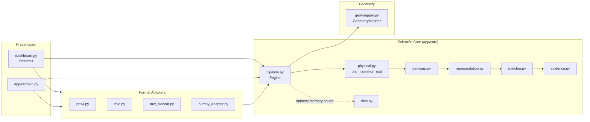

# Component Architecture Diagram

```mermaid
flowchart LR
    subgraph UI["Presentation"]
        DB[dashboard.py<br/>Streamlit]
        CLI[app/cli/main.py]
    end
    subgraph CORE["Scientific Core (app/core)"]
        PHY[physical.py<br/>plan_common_gsd]
        WARP[geowarp.py]
        REP[representation.py]
        TILE[tiles.py]
        MATCH[matcher.py]
        EVID[evidence.py]
        PIPE[pipeline.py<br/>Engine]
    end
    subgraph GEO["Geometry"]
        MAP[geo/mapper.py<br/>GeometryMapper]
    end
    subgraph ADAPT["Format Adapters"]
        PDS4[pds4.py]
        ENVI[envi.py]
        RAW[raw_sidecar.py]
        NPY[numpy_adapter.py]
    end

    DB --> PIPE
    CLI --> PIPE
    PIPE --> MAP
    PIPE --> PHY --> WARP --> REP --> MATCH --> EVID
    PIPE -.optional memory bound.-> TILE
    DB --> ADAPT
    CLI --> ADAPT
    ADAPT --> PIPE
```

Rendered form of the component-ownership table in
[`docs/03_SYSTEM_ARCHITECTURE.md`](../../03_SYSTEM_ARCHITECTURE.md).
