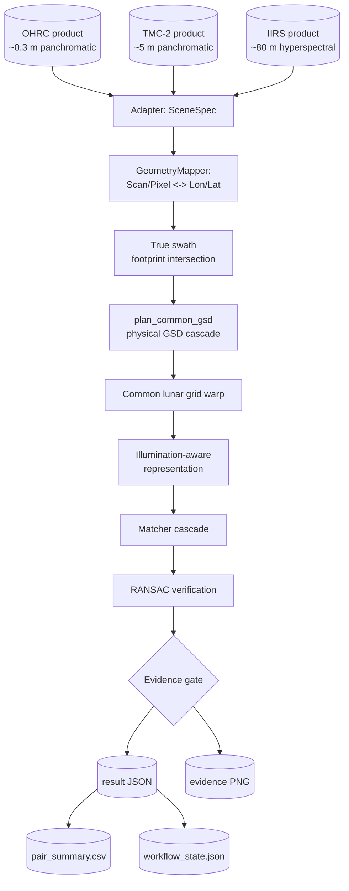

# Data Flow Diagram

```mermaid
flowchart TD
    OHRC[(OHRC product<br/>~0.3 m panchromatic)]
    TMC2[(TMC-2 product<br/>~5 m panchromatic)]
    IIRS[(IIRS product<br/>~80 m hyperspectral)]

    OHRC --> ADAPT[Adapter: SceneSpec]
    TMC2 --> ADAPT
    IIRS --> ADAPT

    ADAPT --> GEOM[GeometryMapper:<br/>Scan/Pixel <-> Lon/Lat]
    GEOM --> OVERLAP[True swath<br/>footprint intersection]
    OVERLAP --> GSD[plan_common_gsd<br/>physical GSD cascade]
    GSD --> GRID[Common lunar grid warp]
    GRID --> REP[Illumination-aware<br/>representation]
    REP --> MATCH[Matcher cascade]
    MATCH --> RANSAC[RANSAC verification]
    RANSAC --> GATE{Evidence gate}
    GATE --> JSON[(result JSON)]
    GATE --> PNG[(evidence PNG)]
    JSON --> CSV[(pair_summary.csv)]
    JSON --> STATE[(workflow_state.json)]
```

Rendered form of the data-flow section in
[`docs/TECHNICAL_DESIGN_REPORT.md`](../../TECHNICAL_DESIGN_REPORT.md).
