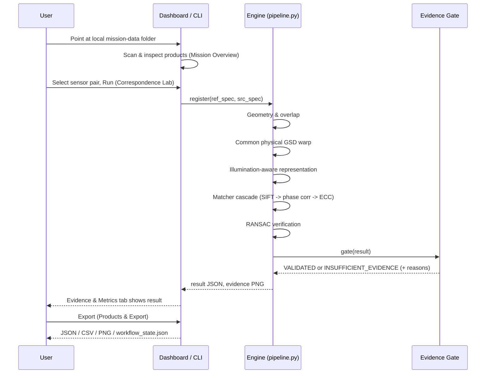

# Experiment Workflow Diagram

```mermaid
sequenceDiagram
    participant U as User
    participant D as Dashboard / CLI
    participant E as Engine (pipeline.py)
    participant G as Evidence Gate

    U->>D: Point at local mission-data folder
    D->>D: Scan & inspect products (Mission Overview)
    U->>D: Select sensor pair, Run (Correspondence Lab)
    D->>E: register(ref_spec, src_spec)
    E->>E: Geometry & overlap
    E->>E: Common physical GSD warp
    E->>E: Illumination-aware representation
    E->>E: Matcher cascade (SIFT -> phase corr -> ECC)
    E->>E: RANSAC verification
    E->>G: gate(result)
    G-->>E: VALIDATED or INSUFFICIENT_EVIDENCE (+ reasons)
    E-->>D: result JSON, evidence PNG
    D-->>U: Evidence & Metrics tab shows result
    U->>D: Export (Products & Export)
    D-->>U: JSON / CSV / PNG / workflow_state.json
```

Rendered form of the protocol in
[`docs/11_EXPERIMENT_PROTOCOL.md`](../../11_EXPERIMENT_PROTOCOL.md).
