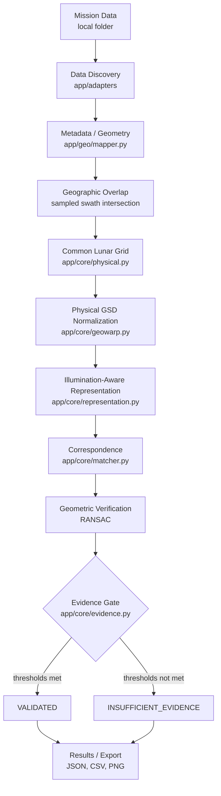

# System Architecture Diagram

Rendered form of the pipeline described in
[`docs/03_SYSTEM_ARCHITECTURE.md`](../../03_SYSTEM_ARCHITECTURE.md). GitHub, GitLab and most
Markdown viewers with Mermaid support render this block directly; CHANDRABHAR-2's own published
documentation pages also render Mermaid natively.
