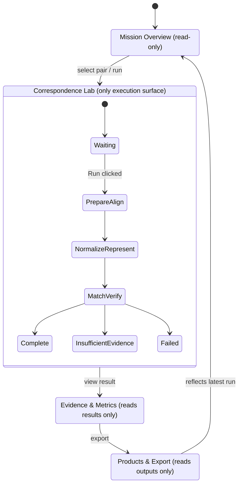

# UI Workflow Diagram

Rendered form of the navigation structure in
[`docs/14_USER_GUIDE.md`](../../14_USER_GUIDE.md). Only **Correspondence Lab** executes
computation; the other three tabs are read-only views over its output, per the platform's
single-execution-surface design.
